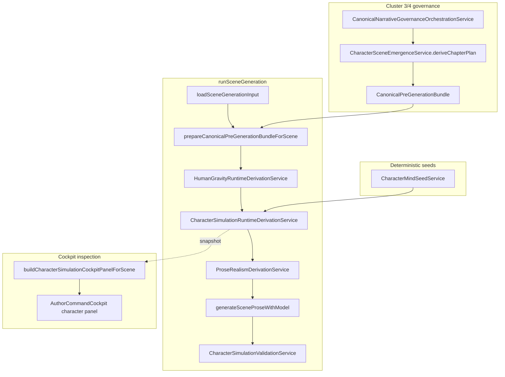

# Character simulation subsystem map (Cluster 8)

## File index

| Concern | Primary module |
|---------|----------------|
| Mind / cognitive types | `lib/domain/character-mind.ts` |
| Voice types | `lib/domain/character-voice.ts` |
| Relationship types | `lib/domain/character-relationship.ts` |
| Emergence digest / chapter plan | `lib/domain/character-scene-emergence.ts` |
| Runtime artifact schema | `lib/domain/character-simulation-runtime.ts` |
| State evolution | `lib/services/character-state-evolution-service.ts` |
| Scene emergence | `lib/services/character-scene-emergence-service.ts` |
| Constraints | `lib/services/character-constraint-service.ts` |
| Runtime bridge | `lib/services/character-simulation-runtime-service.ts` |
| Post-gen validation | `lib/services/character-simulation-validation-service.ts` |
| Admin inspection | `lib/services/character-simulation-cockpit-inspection-service.ts` |
| Tests | `lib/services/cluster8-character-simulation.test.ts` |

## Enforcement registry

Subsystem id: `character_simulation_runtime_cluster8` (see `enforcement-registry-service.ts`).
