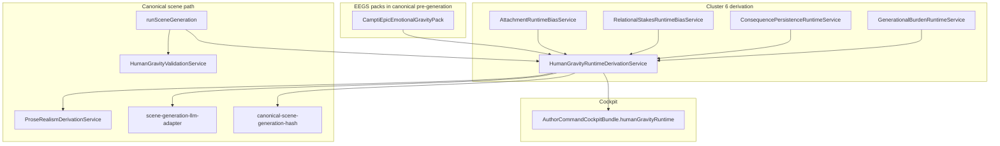

# Human-gravity runtime subsystem map (Cluster 6)

## File index

| Role | Path |
| --- | --- |
| Contract | `lib/domain/human-gravity-runtime.ts` |
| Derivation | `lib/services/human-gravity-runtime-derivation-service.ts` |
| Attachment | `lib/services/attachment-runtime-bias-service.ts` |
| Relational stakes | `lib/services/relational-stakes-runtime-bias-service.ts` |
| Consequence persistence | `lib/services/consequence-persistence-runtime-service.ts` |
| Generational burden | `lib/services/generational-burden-runtime-service.ts` |
| Validation | `lib/services/human-gravity-validation-service.ts` |
| Runtime-active truth labeling | `lib/services/human-gravity-runtime-influence-truth.ts` |
| Governance upstream (EEGS source) | `lib/services/canonical-narrative-governance-orchestration-service.ts` |
| Tests | `lib/services/human-gravity-cluster6.test.ts` |
