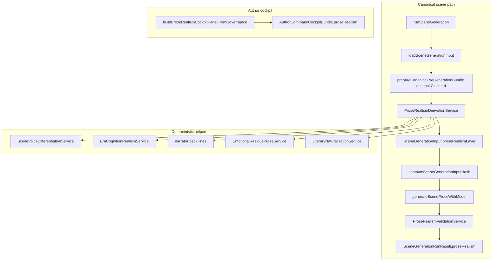

# Prose Realism Subsystem Map (Cluster 5)

## Enforcement

- Subsystem id: `prose_narrative_realism_cluster5` (`enforcement-registry-service.ts`)
- Cockpit panel key: `proseRealism` (`enforcement-cockpit-truth-service.ts`)
