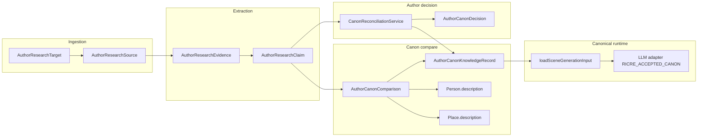

# RICRE subsystem map

## Key boundaries

- **P2-E** narrative sources remain the temporal truth firewall for cited historical text.
- **RICRE** accepted canon is **additional author-gated grounding**, hashed and labeled separately.
- **Cockpit** surfaces queue health; mutations go through services / future admin actions—not the bundle.
